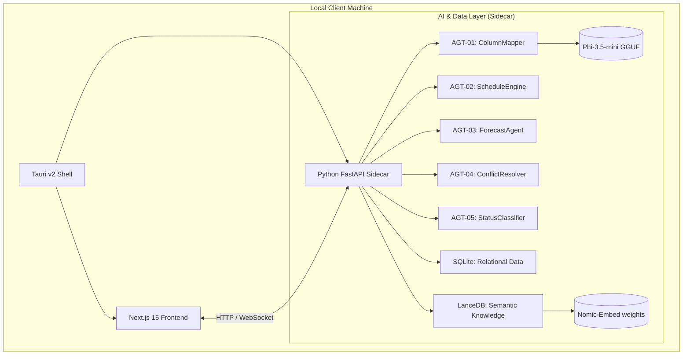

# Project Beta: System Architecture & Workflow

This document outlines the high-level architecture and logic flow for the Equipment Inventory & Maintenance Tracker, following the "Proper Production" alignment completed so far.

---

## 🏗️ High-Level Architecture

---

## 🧠 Core Logic & Agent Workflows

### 1. Data Initialization (Self-Healing)
Every time the Sidecar starts up, it runs a **Self-Healing Sync**:
- **Relational Sync**: Compares the existing `tracker.sqlite` against `schema.sql`. Automatically adds missing columns (like `status` or `serial_number`) without losing data.
- **Semantic Sync**: Loads `lancedb_seed.json` into the vector store to ensure the AI knows what UI fields are available for mapping.

### 2. AGT-01: RAG-Enhanced Mapping
This is the process used during the **Bulk Import** tab:
1. **Header Extraction**: User uploads an Excel file; the frontend extracts column headers.
2. **Search (RAG)**: Headers are sent to the Sidecar via WebSocket. The Sidecar converts each header into a vector and searches **LanceDB** for the top 3 most relevant UI fields.
3. **Reasoning (Local LLM)**: These candidates are fed into **Phi-3.5-mini** (running locally via `llama-cpp-python`).
4. **Structured Output**: The AI returns a Pydantic-validated JSON mapping with confidence scores.
5. **Audit**: The entire thought process is logged to the `agent_audit_log` table.

### 3. AGT-05: Real-Time Status Classification
Whenever the Dashboard or Assets list is loaded:
- The system calculates `days_until_due` by comparing `scheduled_date` to today.
- It applies the **Status Classification Table** (e.g., < 7 days = Critical/Orange-Red).
- These statuses are generated **live** to ensure accuracy without stale cache.

---

## 📡 Communication Flow

| Action | protocol | flow |
|--------|----------|------|
| **Authentication** | REST (POST) | `frontend -> /api/v1/auth/login -> sidecar` (Returns JWT) |
| **Mapping Analysis** | WebSocket | `frontend -> /ws (analyze_mapping) -> sidecar` (Real-time AI stream) |
| **Statistics** | REST (GET) | `frontend -> /api/v1/stats -> sidecar` (Authenticated with Bearer Token) |
| **Model Hosting** | Internal | `sidecar -> file system` (100% Offline read of GGUF/Embeddings) |

---

## 📦 Offline Production Distribution
To ensure the app works "completely fine without internet" on other systems:
- **Bundled Models**: GGUF and Embedding weights are included in the Tauri `.exe` resources.
- **Local Runtimes**: The Python sidecar is compiled into a standalone binary using **Nuitka**, meaning the user doesn't even need Python installed.
- **Zero API Calls**: No part of the system contacts OpenAI, HuggingFace, or any external service after the initial build.

---

> [!TIP]
> **Current Status**: We have successfully finalized the Model Provisioning and basic Sidecar Stability. Your next moves involve cleaning up the remaining runtime 404s and refining the deterministic agents (ScheduleEngine).
